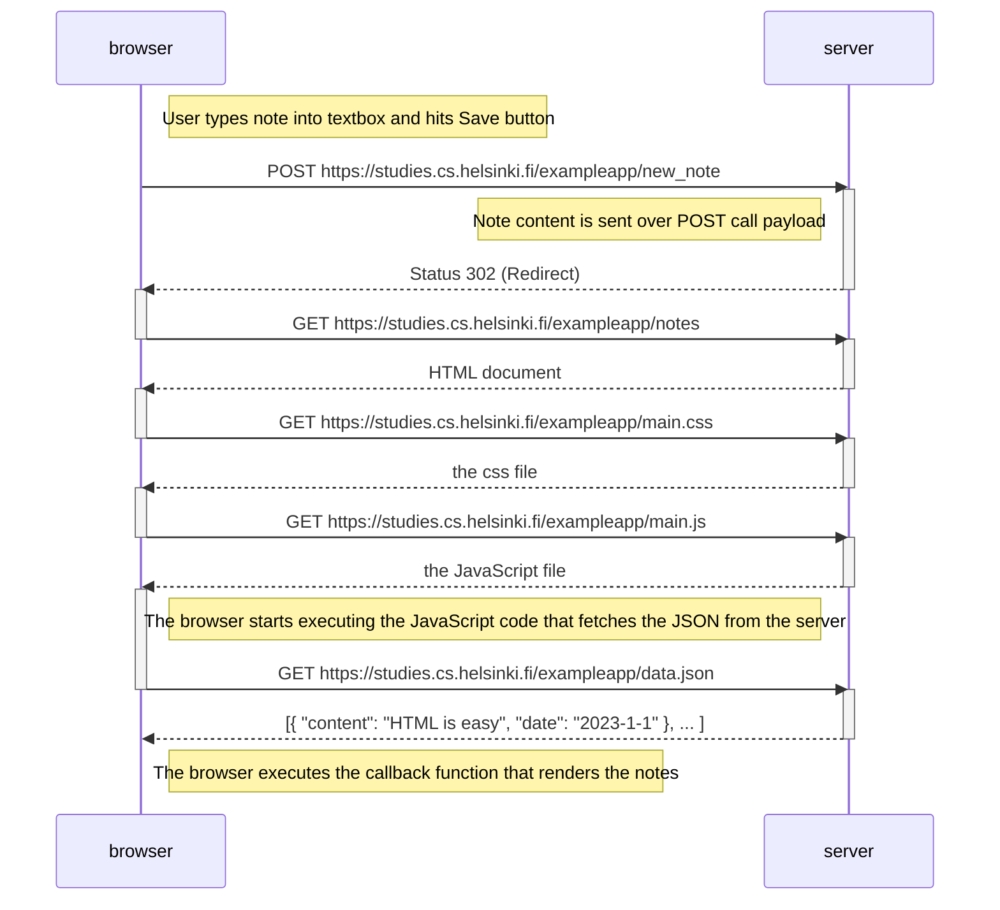

```mermaid
sequenceDiagram
    participant browser
    participant server

    Note right of browser: User types note into textbox and hits Save button

    browser->>server: POST https://studies.cs.helsinki.fi/exampleapp/new_note
    activate server
    Note left of server: Note content is sent over POST call payload
    server-->>browser: Status 302 (Redirect)
    deactivate server
    activate browser

    browser->>server: GET https://studies.cs.helsinki.fi/exampleapp/notes
    deactivate browser
    activate server
    server-->>browser: HTML document
    deactivate server
    activate browser

    browser->>server: GET https://studies.cs.helsinki.fi/exampleapp/main.css
    deactivate browser
    activate server
    server-->>browser: the css file
    deactivate server
    activate browser

    browser->>server: GET https://studies.cs.helsinki.fi/exampleapp/main.js
    deactivate browser
    activate server
    server-->>browser: the JavaScript file
    deactivate server
    activate browser

    Note right of browser: The browser starts executing the JavaScript code that fetches the JSON from the server

    browser->>server: GET https://studies.cs.helsinki.fi/exampleapp/data.json
    deactivate browser
    activate server
    server-->>browser: [{ "content": "HTML is easy", "date": "2023-1-1" }, ... ]
    deactivate server
    activate browser

    Note right of browser: The browser executes the callback function that renders the notes
```
