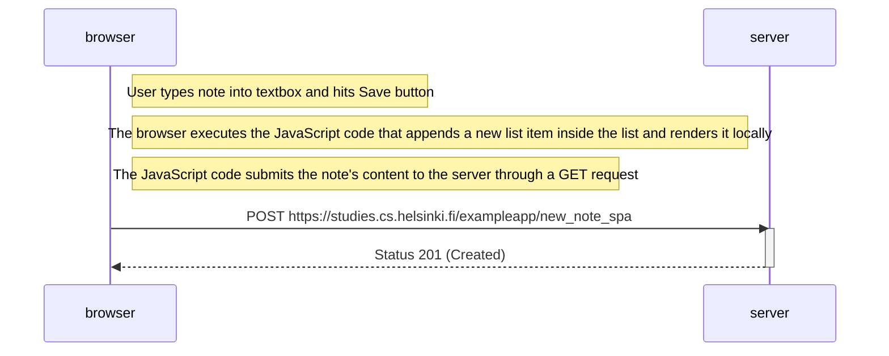

```mermaid
sequenceDiagram
    participant browser
    participant server

    Note right of browser: User types note into textbox and hits Save button
    Note right of browser: The browser executes the JavaScript code that appends a new list item inside the list and renders it locally
    Note right of browser: The JavaScript code submits the note's content to the server through a GET request

    browser->>server: POST https://studies.cs.helsinki.fi/exampleapp/new_note_spa
    activate server
    server-->>browser: Status 201 (Created)
    deactivate server
    activate browser
```
